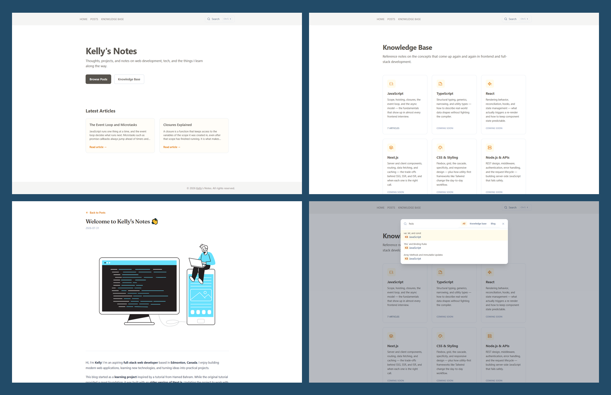

# Kelly's Notes | Next.js + Contentful Content Platform

## Overview

Kelly's Notes is a content platform built with **Next.js (App Router) and Contentful**, serving two
distinct content types from a single headless CMS:

- **Blog Posts** — long-form writing on web development and tech
- **Knowledge Base** — categorized reference articles with difficulty levels and interview questions

The concept: _"Thoughts, projects, and notes on web development, tech, and the things I learn along the way."_

Rather than a static blog, this project treats content as **modeled data**. Each content type has its own
Contentful model, its own rendering pipeline, and its own routing strategy — while sharing a single design
system, search index, and draft preview workflow.

The reference material available for this stack targeted Next.js 13 with the Pages Router and was roughly
three years out of date across Next.js, Contentful, and Tailwind. Rather than pinning old versions to make
it work, I built on the App Router from the start — identifying what each Pages Router pattern was actually
doing, then implementing the current equivalent.

<br />

## Screenshots

<p>
  
  
</p>
---
 
### ▶ Live Demo
 
🔗 https://notes.kellybytes.dev/
 
<br />

## Core Features

### Content Management

- Headless CMS architecture with Contentful
- Two independent content models with separate rendering pipelines
- Rich Text rendering for blog posts (`@contentful/rich-text-react-renderer`)
- Markdown rendering for knowledge base articles (`react-markdown`)
- Category and author relationships modeled as CMS references rather than free-text fields

### Knowledge Base

- Category-based nested routing (`/kb/[category]/[slug]`)
- Difficulty badges (Beginner / Intermediate / Advanced)
- Interview-question sections rendered from structured CMS entries
- Latest articles carousel
- Sorting logic isolated in a dedicated module
- URL/category mismatch returns 404, preventing the same article from resolving under multiple paths

### Draft Preview

- Contentful preview integration built on the Next.js Draft Mode API
- Cached data paths are delivery-only by design, so unpublished content cannot enter a shared server cache
- Every redirect target normalized through a single origin-checking function
- Secret-gated entry point that fails closed when unconfigured
- Animated `PreviewAlert` (Headless UI transitions) with one-click exit back to the current page

### Search

- Prebuilt search index served from a Route Handler (`/api/search-index`)
- Command-palette dialog (⌘K / Ctrl+K) with platform-aware key hints
- Covers both blog posts and knowledge base articles

### User Experience

- Responsive design (Tailwind CSS v4)
- Typographic styling for CMS-generated HTML via `@tailwindcss/typography`
- Route-segment `loading.jsx` skeletons
- Custom `not-found` handling for invalid slugs
- Optimized images through a custom Contentful image loader
- Back-to-top control
- Error boundary with retry and a digest reference for log correlation

<br />

## Tech Stack

### Framework

- **Next.js 16 (App Router)**
- **React 19**
- Server Components
- Route Handlers

### CMS

- Contentful (Delivery API + Preview API)
- `@contentful/rich-text-react-renderer`
- `react-markdown`

### UI

- Tailwind CSS 4
- `@tailwindcss/typography`
- Headless UI

### Deployment

- Vercel

<br />

## Architecture Overview

```
app/
├── api/
│   ├── preview/          → validates secret, resolves entry, enables draftMode()
│   ├── exit-preview/     → disables draftMode(), returns to the current page
│   └── search-index/     → serves the prebuilt search index
├── kb/
│   ├── page.jsx                    → category landing
│   ├── [category]/page.jsx         → article list per category
│   └── [category]/[slug]/page.jsx  → article detail
├── posts/
│   ├── page.jsx
│   └── [slug]/page.jsx
└── layout.jsx

components/
├── kb/       → knowledge base UI (cards, badges, FAQ, carousel)
├── posts/    → blog UI
├── layout/   → navbar & footer
└── ui/       → shared primitives (search, skeleton, preview alert)

lib/
├── contentful/       → API clients and data access
├── kb/               → sorting & domain logic
├── utils/            → shared helpers, including redirect normalization
└── preview-routes.js → content-type → path resolution
```

### Architectural Highlights

- **Data access isolated from UI.** All Contentful queries live in `lib/contentful/`; components never touch the CMS SDK directly.
- **Two renderers, two concerns.** Rich Text and Markdown pipelines are deliberately kept separate rather than forced into a shared abstraction.
- **Server Components by default.** `"use client"` is applied only where interactivity or non-serializable props require it.
- **Caching decided per data-access function**, with draft access deliberately routed outside the cache.
- **Route-segment streaming** via colocated `loading.jsx` files.

<br />

## Content Model

| Content Type | Body Field           | Key Fields                                                      |
| ------------ | -------------------- | --------------------------------------------------------------- |
| **Post**     | Rich Text            | title, slug, excerpt, cover image, author, published date       |
| **Article**  | Long Text (Markdown) | title, slug, category, difficulty, summary, interview questions |
| **Category** | —                    | name, slug, description, order                                  |
| **Author**   | —                    | name, avatar, bio                                               |

The body field types were chosen intentionally. Blog posts benefit from Rich Text's embedded-entry support and structured editing, while knowledge base articles are code-heavy and are authored far more efficiently in Markdown.

<br />

## Building Without a Working Reference

Because no line of the reference material could be copied as-is, every step required identifying the _intent_ behind a Pages Router pattern before implementing its current equivalent.

| Concern        | Pages Router pattern                    | App Router implementation                            |
| -------------- | --------------------------------------- | ---------------------------------------------------- |
| Data fetching  | `getStaticProps` / `getServerSideProps` | `async` Server Components                            |
| Dynamic routes | `getStaticPaths`                        | `generateStaticParams`                               |
| API endpoints  | default-export handler, `res.json()`    | Route Handlers, named method exports, `NextResponse` |
| Draft preview  | `res.setPreviewData()`                  | `draftMode()` (async in v15+)                        |
| App shell      | `_app.js` / `_document.js`              | nested `layout.jsx`                                  |
| Metadata       | `next/head`                             | Metadata API                                         |
| Revalidation   | `revalidate` returned from props        | cache configuration per data-access function         |
| Loading states | manual router-event handling            | route-segment `loading.jsx`                          |
| Styling        | Tailwind v3 (`tailwind.config.js`)      | Tailwind v4 (CSS-first configuration)                |

Version drift compounded the problem: Next.js, the Contentful SDK, and Tailwind had all shipped breaking changes, so error messages rarely matched anything documented in the source material.

<br />

## Key Technical Learnings

### 1. Draft Content and Shared Server Caches

In the Pages Router, preview was scoped to a page's `getStaticProps`. In the App Router, caching happens at the _data-access function_ level — and `unstable_cache` has no awareness of draft mode. A cached function that branches on draft state internally will happily store draft content under a key that public visitors also read.

This project handles that in two layers:

- **Isolation.** Listing queries never accept a preview flag at all, so there is no code path by which drafts can enter a cached result.
- **Bypass.** Single-entry lookups branch _above_ the cache, so preview requests never read from or write to it.

Isolation is the stronger of the two: it cannot be broken by writing the branch on the wrong line.

### 2. Redirects Are a Single Boundary, Not a Series of Checks

The preview flow has two redirect exits. String-based validation (`startsWith('/')`, rejecting `//`) turned
out to be insufficient — in the WHATWG URL spec a backslash is treated as a forward slash for http(s) URLs,
so `/\evil.com` resolves to an external origin.

The fix was to stop pattern-matching suspicious input and instead normalize every redirect target through
one function that parses the URL and compares its origin. Validation lives in one place; how a failure is
handled is decided per call site — exit-preview falls back to the home page, while preview returns an error,
because a failure there indicates a data or code problem rather than user input.

### 3. Draft Mode Does Not Force Dynamic Rendering

Reading `draftMode()` in a page component looked like it should opt the entire route out of static
generation. Build output showed otherwise: routes using `generateStaticParams` still prerender, and only
requests carrying a draft cookie are rendered on demand. Public visitors get static HTML; the editor gets
current drafts. Verifying this in the build output rather than assuming it changed how I reason about
Dynamic APIs generally.

### 4. Closures Can Hide Initialization Order

Cached fetchers were originally created inside factory functions, which deferred evaluation until call
time. Hoisting them to module scope — the correct approach, since `unstable_cache` already includes
arguments in its key — surfaced a temporal dead zone error that the closure had been masking. A refactor
that reveals a latent bug is a good outcome, not a regression.

### 5. Styling Content You Did Not Author

Tailwind's Preflight resets browser typographic defaults, which is ideal for components but breaks
CMS-generated HTML where class names cannot be applied to individual elements. The `prose` plugin exists
precisely for this case — a reminder that a tool's design intent usually explains its behavior.

<br />

## Getting Started

```bash
git clone https://github.com/KellyBytes/contentful-knowledge-base.git
cd contentful-knowledge-base
npm install
cp .env.sample .env
npm run dev
```

### Environment Variables

```
CONTENTFUL_SPACE_ID=
CONTENTFUL_ACCESS_TOKEN=
CONTENTFUL_PREVIEW_ACCESS_TOKEN=
CONTENTFUL_PREVIEW_SECRET=
```

A Contentful space configured with the content models described above is required.

<br />

## Deployment

Deployed to **Vercel** with:

- Automatic GitHub integration
- Environment-scoped secrets
- Incremental Static Regeneration on a 60-second revalidation window

<br />

## Future Improvements

- Contentful webhooks for on-demand revalidation instead of time-based ISR
- Migration from `unstable_cache` to the `use cache` directive
- Tag-based cross-linking between blog posts and knowledge base articles
- RSS feed and sitemap generation
- Table of contents and reading progress indicator
- Full-text search backed by a dedicated index rather than a static payload

<br />

## Why This Project Matters

Kelly's Notes demonstrates my ability to:

- Implement current framework patterns from first principles when reference material is outdated
- Design content models before implementation, rather than retrofitting structure onto content
- Reason about caching as a correctness and security concern, not only a performance one
- Identify and close a real vulnerability class, and generalize the fix rather than patching one instance
- Separate data access, domain logic, and presentation into maintainable layers
- Ship and maintain a live application that grows over time

It also serves a practical purpose: it is where I document what I learn, which means it is continuously used, maintained, and extended rather than finished and archived.

<br />

[🔼 Back to Top](#kellys-notes--nextjs--contentful-content-platform)
